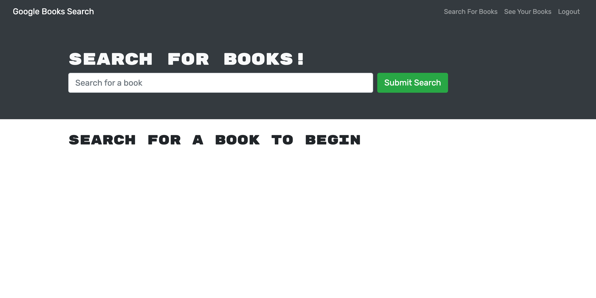
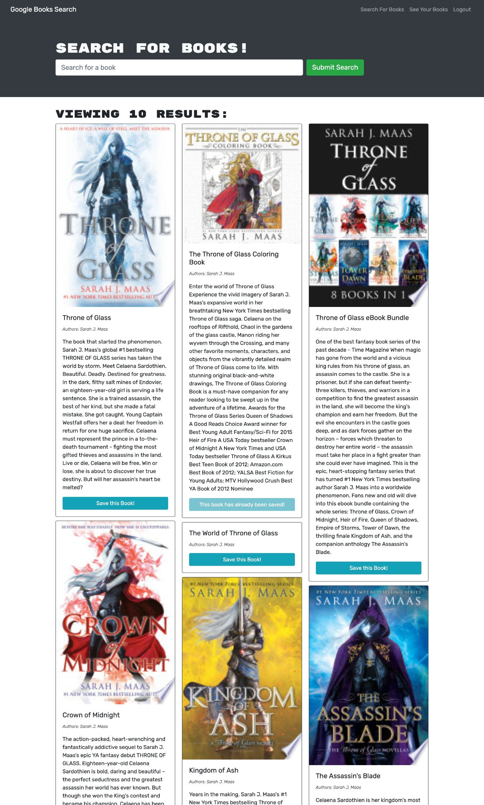

  
  
# The Book Search

A Google Books API search engine.  

## Table of Contents

  * [Description](#description)
  * [License](#license)
  * [Preview](#preview)
  * [Questions](#questions)

## Description

This Google Books API search engine was built with a RESTful API and refactored to be a GraphQL API built with Apollo Server. This application was built using the MERN stack with a React front end, MongoDB database, and Node.js/Express.js server and API. 

When a reader visits the site, they are able to search for books within the Google Books API. Readers are able to create an account and login. When logged in, a reader may search for a book and save their favorite books. The See Your Books page displays all saved books. Logged in readers also have access to delete books from this page. 

This application is perfect for avid readers that want to search for new books to read and keep a list of books to purchase.

The UI is clean, polished, and will help the User navigate the site with ease.

This application was built using the following:

* Javascript
* HTML & CSS
* React
* MongoDB
* Apollo Server
* GraphQL
* Express.js
* Node.js

## License

This application is covered under the MIT license.

### Application Screenshots

Preview screens of the application. 

#### HOMEPAGE

#### ACCOUNT VIEW

#### SAVED BOOKS

## Preview

GitHub Repo: https://github.com/jsamborski310/The-Book-Search

Heroku: https://js-the-book-search.herokuapp.com/

## Questions

For questions about this application or if you would like to collaborate, connect with me on <a href="https://www.linkedin.com/in/juanita-samborski/" target="_blank">Linkedin</a>.

